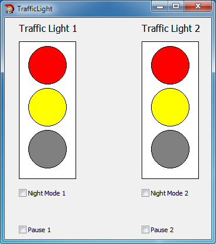

# Multiple Interpreters
This example demonstrates how to use multiple interpreters in VCL forms application. We create 2 instances of interpreter with passing [traffic light SCXML](../../../Examples/StateCharts/TrafficLight.scxml)

