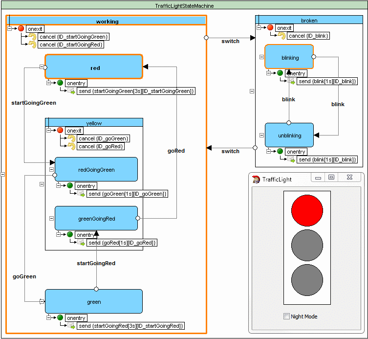
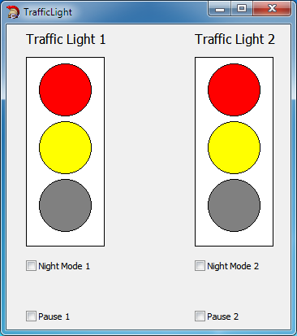
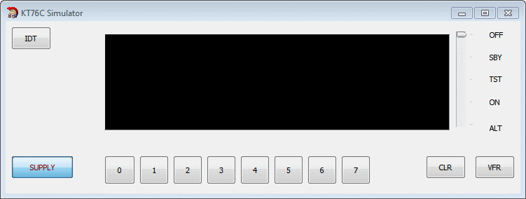
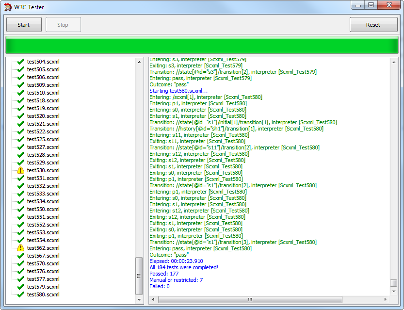
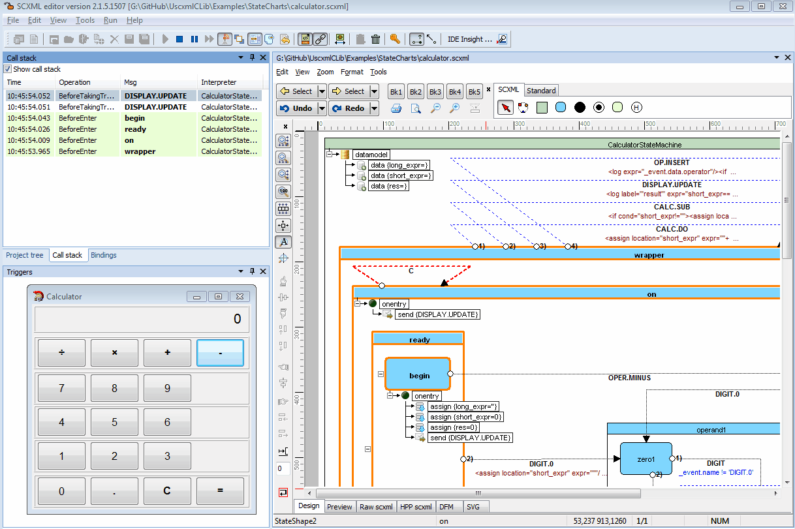
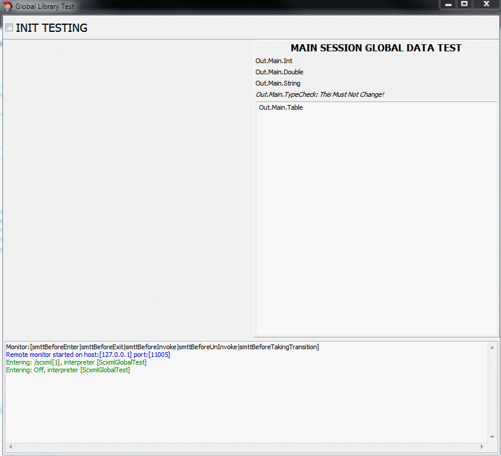

# UscxmlCLib C++ Builder Examples
Demonstrate how to use [UscxmlCLib](https://github.com/alexzhornyak/UscxmlCLib) in C++ Builder

### [1. Hello World](https://github.com/alexzhornyak/UscxmlCLib/tree/master/Examples/BCB/HelloWorld)

### [2. Traffic Light](https://github.com/alexzhornyak/UscxmlCLib/tree/master/Examples/BCB/TrafficLight)

### [3. Multiple Interpreters](https://github.com/alexzhornyak/UscxmlCLib/tree/master/Examples/BCB/MultipleInterpreters)

### [4. KT76C Transponder Simulator](https://github.com/alexzhornyak/UscxmlCLib/tree/master/Examples/BCB/KT76CSim)

### [5. Salus RT500 (Digital Room Thermostat) Simulator](https://github.com/alexzhornyak/UscxmlCLib/tree/master/Examples/BCB/SalusRT500Sim)

### [6. W3C SCXML Testing Application](https://github.com/alexzhornyak/UscxmlCLib/tree/master/Examples/BCB/TesterW3C)

### [7. Calculator](https://github.com/alexzhornyak/UscxmlCLib/tree/master/Examples/BCB/Calculator)

### [8. Library Testing Application](https://github.com/alexzhornyak/UscxmlCLib/tree/master/Examples/BCB/GlobalTestLibrary)

