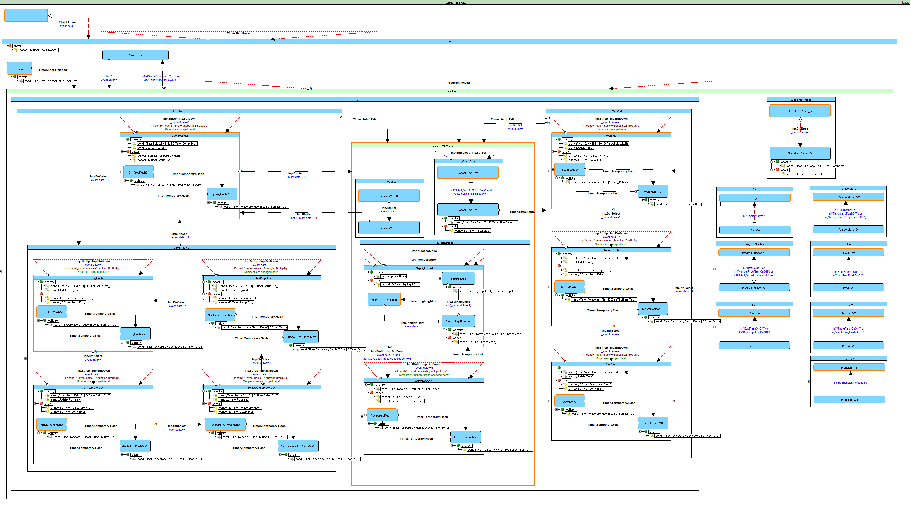

# Salus RT500 Simulator (VCL)
**Salus RT500 (Digital Room Thermostat) Simulator** is a VCL forms application that demonstrates usage of mixed C++ Data Model and SCXML Device logic

## Use [SCXML Editor](https://github.com/alexzhornyak/ScxmlEditor-Tutorial) for [SalusRT500Logic.scxml](https://github.com/alexzhornyak/UscxmlCLib/blob/master/Examples/StateCharts/SalusRT500Logic.scxml) editing or viewing

