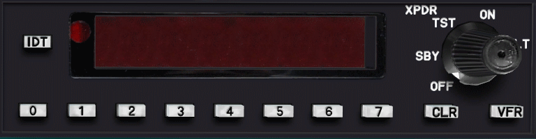
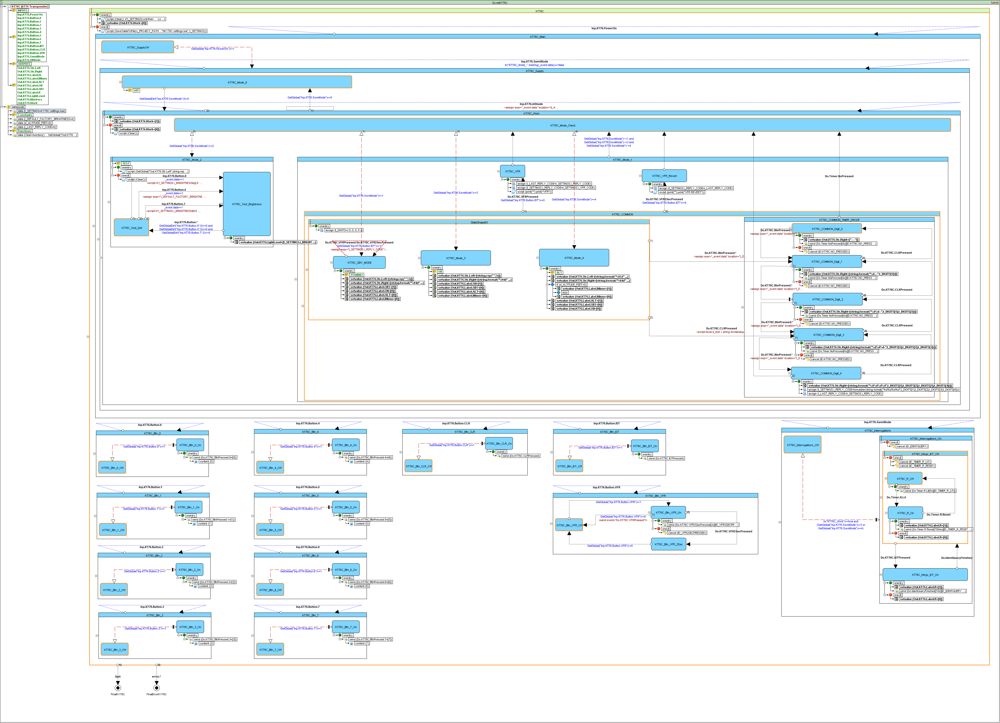

# KT76C Transponder Simulator (Qt)

The BendixKing KT 76C transponder - radio transmitter/receiver which operates on radar frequencies

## SCXML Device Logic

## Objective
This example shows how to use [UscxmlCLib](https://github.com/alexzhornyak/UscxmlCLib) in Qt Widget Application

