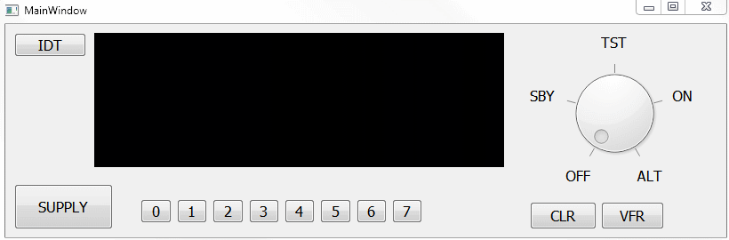
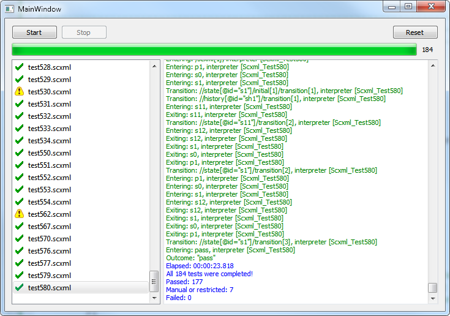

# UscxmlCLib Qt Examples
Demonstrate how to use [UscxmlCLib](https://github.com/alexzhornyak/UscxmlCLib) in Qt

## Table of contents

### [1. KT76C Transponder Simulator](https://github.com/alexzhornyak/UscxmlCLib/tree/master/Examples/Qt/KT76CSim)

### [2. W3C SCXML Testing Application](https://github.com/alexzhornyak/UscxmlCLib/tree/master/Examples/Qt/TesterW3C)

